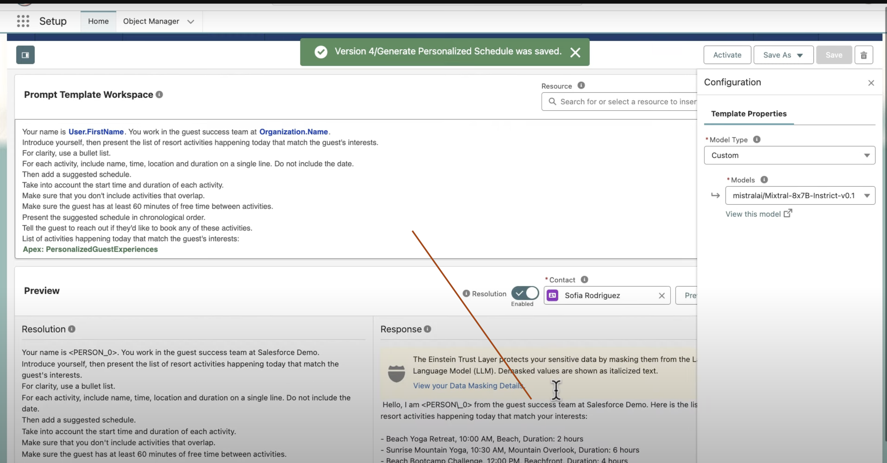

# Bring Your Own Large Language Model (BYOLLM)


## Topics

- [Overview](#overview)
- [Einstein Trust Layer](#trustlayer)
- [Set Up Einstein Generative AI](#SetUpEinsteinGenerativeAI)
- [LLM Open Connector](#llmoc)
- [Video How To Bring Your Own LLM With LLM Open Connector](#demo)
- [Billing](#billing)
- [References](#ref)

<a name='overview'></a>
- The Bring Your Own Large Language Model (BYOLLM) capability enables you to add a foundation model hosted on an external platform and connect it with Einstein Studio. You can use the foundation model to create a model configuration to power your generative AI. Evaluate the model’s response to your prompts in Model Playground with different settings before you deploy the model to production.

Some common reasons companies want to use different models with Einstein include:

- Your company has an LLM fine-tuned to your data.
- You can use your Azure, Bedrock, OpenAI, or Vertex account.

- BYOLLM supports all the Salesforce-managed models and these additional models:

    - Anthropic Claude 3 Opus
    - Anthropic Claude 3 Sonnet
    - Anthropic Claude 3.5 Sonnet
    - Azure Open AI GPT-4o
    - OpenAI GPT-4o
    - Vertex AI (Google) Gemini 1.5 Pro


<a name='trustlayer'></a>


<a name="SetUpEinsteinGenerativeAI" ></a>
## Set Up Einstein Generative AI

### Step 1: Verify Data Cloud in Your Org


- If you see the Data Cloud Cloud Setup looks like above,  contact your Salesforce Account Executive (AE).

- Requirements
    - Before turning on Einstein generative AI features, make sure Data Cloud is provisioned and enabled in your org. **Data Cloud** is required for essential Einstein Generative AI functionality, such as the **Trust Layer**.

### Step 2: Turn On Einstein Generative AI
```
Setup >  Einstein Setup

```
- If you can’t find Einstein Setup, ensure that your org meets the prerequisites for any generative AI features you plan to use. For more support, contact your Salesforce Account Executive (AE).

### Step 3: Set Up Einstein Trust
- Build trust in your generative AI. Use the Einstein Trust Layer to personalize data privacy controls that are integrated into the end-user experience.

    - From Setup, in the Quick Find box, enter **Einstein**, and then select **Einstein Trust Layer**
    - **Data Masking** is enabled by default. Enable data masking if it’s turned off to allow the Einstein Trust Layer **to detect and mask sensitive data**.
    - Individual entities or categories can be turned off or turned on. **It can take up to a few minutes for the changes to take effect**.

### Step 4: Turn On Einstein Data Collection and Storage

- Store your Einstein generative AI **audit and feedback data in Data Cloud**. You can use that data for **compliance, analytics, prompt adjustments, and LLM tuning** to enhance your generative AI applications

- By turning on Einstein data collection and storage, **you consent to store your Salesforce organization's generative AI activity log and feedback data in Data Cloud**. Consent also assumes you’ve **reviewed any potential cost implications and assume responsibility for any associated costs 

    - Usage of certain Data Cloud features **impacts credit consumption**. To monitor your usage in these Data Cloud usage categories, access your org’s **Digital Wallet**. For more information on how usage is billed, refer to your contract or contact your account executive.
    - The number of credits consumed is based on the number of units of each usage type used multiplied by the multiplier listed on the rate card for the usage type. In Digital Wallet, Data Cloud consumption is tracked on the following consumption cards.


- [Refer Data cloud billing](#DataCloudBillableUsageTypes)

- System admin: Turn On Einstein Generative AI Data Collection and Storage.
- System admin: Access Einstein Generative AI Audit and Feedback Data Reports and Dashboards.

## Add a Foundation Model

- 1. In Einstein Studio, go to the Generative tab.

 - 2. Click Add Foundation Model.


- 3. Select the type of foundation model that you want to connect, and click Next.


- 4. Connect to the model endpoint.
    - Enter the endpoint name and URL ( a standard HTTPS 443 port is required.)
    - Enter your authentication details (named credential)
    - Enter the model information.
    - 


---


<a name="billing"></a>

## Data Cloud Billable Usage Types

|Billing Category| Description|
|---|---|
|Batch Data Pipeline|Usage is calculated based on the amount of **batch data** processed by Data Cloud data streams across all connectors.
|Batch Data Transforms|Usage is calculated based on the higher of the number of rows read or number of rows written.  For incremental batch data transforms, after the first time a transform runs, usage is based on the number of rows that have changed since the previous run.|
|Batch Profile Unification|	Usage is calculated based on the number of source profiles processed by an identity resolution ruleset. After the first time a ruleset runs, only new or modified source profiles are counted. A source profile is an individual and their related records, such as contact points and party identifiers, which are included in the identity ruleset.  For example, modified means deleted profiles, or profiles marked as suppressed via Consent API preferences.|
|Batch Calculated Insights|Usage is calculated based on the number of records in all underlying objects used in creating the Calculated Insight each time it runs.|
Data Queries|Usage is calculated based on the number of records processed. The count of records processed depends on the structure of a query as well as other related factors such as the total number of records in the objects being queried.|
|Unstructured Data Processed|Usage is calculated based on the amount of unstructured data that is processed. For example, if the search index processes 100 PDF documents that are 1 MB each, usage is calculated as 100 MB. If the search index processes five audio/video files that are on average 100MB each, usage is calculated as 500MB. In Data Cloud, unstructured data may be **chunked and vectorized using an embedding model**. Usage is computed only once across both these activities. For example, if one 100 MB PDF document is chunked and vectorized, usage is computed as 100 MB, not as 200MB.|
|Streaming Data Pipeline|Usage is calculated based on the number of records ingested by data streams with stream processing. Data streams with stream processing include web, mobile, and streaming ingestion API.|
|Streaming Data Transforms|Usage is calculated based on the number of records processed.|
|Streaming Calculated Insights|Usage is calculated based on the number of records processed.|
|Streaming Actions (including lookups)|Usage is calculated based on the number of records processed. A lookup is an enrichment from a related object.|
|Inferences|Usage is calculated based on the **number of unique inferences produced by a predictive model**. A single inference includes one prediction and, optionally, one or more prescriptions and one or more top predictors. Inferences are consumed for any predictive AI model used, whether internal (built in Einstein Studio AI) or external (Bring Your Own Model).|
|Data Share Rows Shared (Data Out)|Usage is calculated based on the number of new and changed records that are processed as part of the data share.|
|Data Federation or Sharing Rows Accessed|For data federation, usage is calculated based on the number of records returned from the source. For a data share, usage is calculated based on the number of rows returned to fulfill an external data lake’s request.  For a data share, this usage applies only to cross-region or cross-cloud queries. There’s no credit consumption if the query originates from the same region and the same cloud.|
|Sub-second Real-Time Events & API|	Usage is calculated based on the sum of the number of profile events, engagement events, and API calls processed in the sub-second real-time layer, including web and mobile SDKs traffic. Profile events, engagement events, and API calls are processed in the real-time layer if they are associated with a real-time data graph.  For example, if 3 profile events, 10 engagement events, and 20 API calls are processed during a particular billing period, the total processed is 33.|
|Private Connect Data Processed|Usage is calculated based on the volume of data in GBs that are transferred over the private network route. This applies to the transfer of data into Data Cloud and the transfer of data to an external data source|
|Data Storage Allocation|Storage usage applies to Data Cloud, Data Cloud for Marketing, and Data Cloud for Tableau customers.Usage is calculated based on the amount of storage used above the amount allocated.|
|Data Spaces|Data space usage applies to Data Cloud, Data Cloud for Marketing, and Data Cloud for Tableau customers.Usage is calculated based on the number of data spaces beyond the default data space.|
|Segmentation and Activation|Service usage calculations for segmentation and activation are based on records of data processed, queried, or analyzed. Service usage applies to Data Cloud for Marketing customers only.|
|Ad Audiences Service Usage|Usage is calculated based on the number of ad audience targets.|
|Data Cloud Real-Time Profile|Usage is calculated based on the total number of unique real time data graph records (Profiles for users) that appeared in real time record cache during the billing month. Even if a single unique record appears more than once, it’s only counted once.For example, if a real-time data graph’s primary data model object has 10 million rows cached on the first day of the month, and 1 million unique records are added to the real time cache daily for 30 days, the total count is 40 million|

<a name='llmoc'></a>

##  LLM Open Connector
- The LLM Open Connector is an [API specification](https://opensource.salesforce.com/einstein-platform/docs/apis/llm-open-connector), closely based on the OpenAI API, that lets you create API gateways and proxy servers that connect any language model to the Einstein AI Platform. Any service that implements the API specification can be connected to Einstein Studio using the Bring Your Own LLM (BYOLLM) feature.

- The LLM Open Connector opens up a world of possibilities for bespoke AI applications for Salesforce customers and independent software vendors (ISVs). Check out our recipes to learn how to bring new models to Einstein Studio!


### Middleware to connect to LLM Connector


- Reshaping the response to match LLM Connector requirements
- 
- 


- Deploy Middleware to Heroku
- 

- Add Foundation Model
- 

- Connect to your LLM
- 

- Provide Connection Details to your LLM
- 

- We will test this connection and your model will be list if successful
- 

- Create a Config for this newly added model
- 

- Quick Test the model
- 

#### Prompt Builder
- 
- Standard Models
- 

- We can use this newly connected Custom Model
- 

- Now test the prompt with this newly connected Custom Model
- 
- Note: Einstein Trust Layer for this custom model as well


#### Agent Builder
- [Agent Builder](img/llm-agentbuilder.png)

- Response from the custom model
- 
- 


#### Using in Apex
- 
- 


<a name='demo'></a>

#### Video How To Bring Your Own LLM With LLM Open Connector
[](https://www.youtube.com/watch?v=CQdJxKZl0Y4)


---


<a name='ref'></a>

## References
- [Use the LLM Open Connector to Build Generative AI Solutions Using Your Preferred Models and Platforms](https://developer.salesforce.com/blogs/2024/10/build-generative-ai-solutions-with-llm-open-connector)
- [Bring Your Own Large Language Model](https://help.salesforce.com/s/articleView?id=data.c360_a_ai_foundation_models.htm&type=5)
- [Set Up Einstein Generative AI](https://help.salesforce.com/s/articleView?id=ai.generative_ai_enable.htm&type=5)
- [Data Cloud Billable Usage Types](https://help.salesforce.com/s/articleView?id=data.c360_a_data_usage_types.htm&type=5)
- [Create Named Credentials and External Credentials](https://help.salesforce.com/s/articleView?id=xcloud.nc_named_creds_and_ext_creds.htm&type=5)
- [LLM Support](https://help.salesforce.com/s/articleView?id=ai.generative_ai_large_language_model_support.htm&type=5)
- [ LLM Open Connector](https://opensource.salesforce.com/einstein-platform/open-connector)

- [Video How To Bring Your Own LLM With LLM Open Connector](https://www.youtube.com/watch?v=CQdJxKZl0Y4&t=16s)


- [LLM Open Connector + Hugging Face](https://opensource.salesforce.com/einstein-platform/huggingface)

- [Git hub repo for einstein-platform ](https://github.com/salesforce/einstein-platform)


