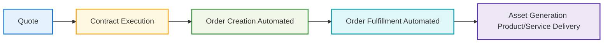

## Revenue Cloud Architecture
Revenue Cloud is a unified product-to-cash suite for omnichannel buying and selling. It’s made up of several components to support all stages of the sales cycle.

```mermaid
graph TD
    A[Revenue Cloud<br>Unified Product-to-Cash Suite] --> B[CPQ]
    A --> C[Billing]
    A --> D[Partner Relationship Management]
    A --> E[Subscriptions]
    A --> F[Sales Agreements]
    A --> G[Digital Channels<br>eCommerce, Self-service Portals]
    A --> H[Revenue Recognition]

    B --> I[Product Configuration]
    B --> J[Pricing Rules]
    B --> K[Quote Generation]

    C --> L[Invoicing]
    C --> M[Payment Collection]
    C --> N[Tax and Compliance]

    D --> O[Partner Onboarding]
    D --> P[Partner Quoting]

    E --> Q[Subscription Management]
    E --> R[Recurring Revenue]

    F --> S[Contract Terms]
    F --> T[Volume-Based Discounts]

    H --> U[Automated Revenue Schedules]
    H --> V[GAAP Compliance]

    style A fill:#e3f2fd,stroke:#1e88e5,stroke-width:2px
    style B fill:#fff3e0,stroke:#fb8c00,stroke-width:1.5px
    style C fill:#fff3e0,stroke:#fb8c00,stroke-width:1.5px
    style D fill:#fff3e0,stroke:#fb8c00,stroke-width:1.5px
    style E fill:#fff3e0,stroke:#fb8c00,stroke-width:1.5px
    style F fill:#fff3e0,stroke:#fb8c00,stroke-width:1.5px
    style G fill:#fff3e0,stroke:#fb8c00,stroke-width:1.5px
    style H fill:#fff3e0,stroke:#fb8c00,stroke-width:1.5px
```

 

## Product Catalog

- A great sales experience starts with a strong foundation: setting up the product catalog and defining pricing.

- Once the catalog is in place, customers and sales reps can easily create and submit quotes.

-  Quotes evolve into contracts and orders, bringing customer assets to life. 

- The last step ties it all together—generating invoices

Revenue Cloud streamlines the process so that everyone involved enjoys a seamless journey from start to finish.

## Product Catalog Management
-  Defines a shared catalog for storing product information.
- One we have the catalog, use Salesforce Pricing to price those products. 
    - For complex products, use **Product Configurator** to set them up to be configurable during product selection. 
    - Example: You can set up a phone such that customers can **configure it :**
    1. by selecting a specific color**
    2. by selecting storage capacity 
    during product selection.

## End Customers
- End users are typically 
  - customers 
  -  sales reps, 
- Browse the product catalog and select products to build a quote.

## Contracts
- With successful execution of contracts, automated processes efficiently turn quotes into orders and fulfill orders into assets. 

Shared catalog supports the amendment, renewal, and cancellation of quotes, orders, and contracts. 

## Invoice Management 
- monetizes sales through:
 1. invoice generation, including tax calculations for products and services delivered to customers.
 2.  All these Revenue Cloud components use the same product data from your product catalog.

## API
- Using APIs, you can automate business processes like complex product bundling and product configuration. Other cloud services can use these composable APIs to access Revenue Cloud features.

##  Invocable Actions
- use to create reusable actions
- encapsulate a process and can be invoked from various applications in the Salesforce environment and from external applications.

## Product Catalog Building Blocks

The setup process involves four main stages.

1. Define products and their attributes.
2. Create reusable product categories to classify products.
3. Build bundles and product offerings.
4. Configure rules to govern product visibility, packaging, and attribute configurations.

- Salesforce Pricing, Transaction Management, Dynamic Revenue Orchestrator, and Invoice Management use Shared Catalog

### How to start:
- Start by creating the **product catalog**, which is a container for all other objects
- Next create the product attributes
- Next create templates—called **product classifications**  to create product variations

Products can be simple stand-alone offerings or bundled products that offer flexibility and scalability in your go-to-market options.

###  Creating quotes
- Customers and sales reps can view products and product bundles,
    -  including product images, descriptions, product attributes, prices, and buying options in a single comprehensive view.
- A well-organized product-browsing experience makes it easy for sales reps and customers to efficiently identify the most suitable products.

## References

- [Revenue Cloud Design](https://trailhead.salesforce.com/content/learn/modules/revenue-cloud-design/set-up-your-product-offerings)
