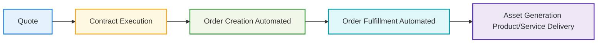

## Revenue Cloud Architecture
Revenue Cloud is a unified product-to-cash suite for omnichannel buying and selling. It’s made up of several components to support all stages of the sales cycle.

```mermaid
graph TD
    A[Revenue Cloud<br>Unified Product-to-Cash Suite] --> B[CPQ]
    A --> C[Billing]
    A --> D[Partner Relationship Management]
    A --> E[Subscriptions]
    A --> F[Sales Agreements]
    A --> G[Digital Channels<br>eCommerce, Self-service Portals]
    A --> H[Revenue Recognition]

    B --> I[Product Configuration]
    B --> J[Pricing Rules]
    B --> K[Quote Generation]

    C --> L[Invoicing]
    C --> M[Payment Collection]
    C --> N[Tax and Compliance]

    D --> O[Partner Onboarding]
    D --> P[Partner Quoting]

    E --> Q[Subscription Management]
    E --> R[Recurring Revenue]

    F --> S[Contract Terms]
    F --> T[Volume-Based Discounts]

    H --> U[Automated Revenue Schedules]
    H --> V[GAAP Compliance]

    style A fill:#e3f2fd,stroke:#1e88e5,stroke-width:2px
    style B fill:#fff3e0,stroke:#fb8c00,stroke-width:1.5px
    style C fill:#fff3e0,stroke:#fb8c00,stroke-width:1.5px
    style D fill:#fff3e0,stroke:#fb8c00,stroke-width:1.5px
    style E fill:#fff3e0,stroke:#fb8c00,stroke-width:1.5px
    style F fill:#fff3e0,stroke:#fb8c00,stroke-width:1.5px
    style G fill:#fff3e0,stroke:#fb8c00,stroke-width:1.5px
    style H fill:#fff3e0,stroke:#fb8c00,stroke-width:1.5px
```

## Product Catalog

- A great sales experience starts with a strong foundation: setting up the product catalog and defining pricing.

- Once the catalog is in place, customers and sales reps can easily create and submit quotes.

-  Quotes evolve into contracts and orders, bringing customer assets to life. 

- The last step ties it all together—generating invoices

Revenue Cloud streamlines the process so that everyone involved enjoys a seamless journey from start to finish.

## Product Catalog Management
-  Defines a shared catalog for storing product information.
- One we have the catalog, use Salesforce Pricing to price those products. 
    - For complex products, use **Product Configurator** to set them up to be configurable during product selection. 
    - Example: You can set up a phone such that customers can **configure it :**
    1. by selecting a specific color**
    2. by selecting storage capacity 
    during product selection.

## End Customers
- End users are typically 
  - customers 
  -  sales reps, 
- Browse the product catalog and select products to build a quote.

## Contracts
- With successful execution of contracts, automated processes efficiently turn quotes into orders and fulfill orders into assets. 

