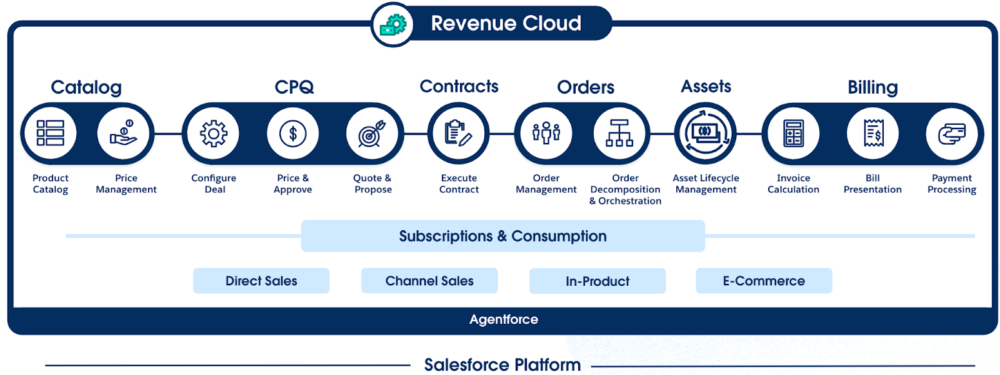
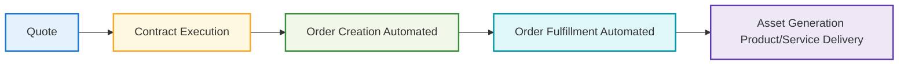
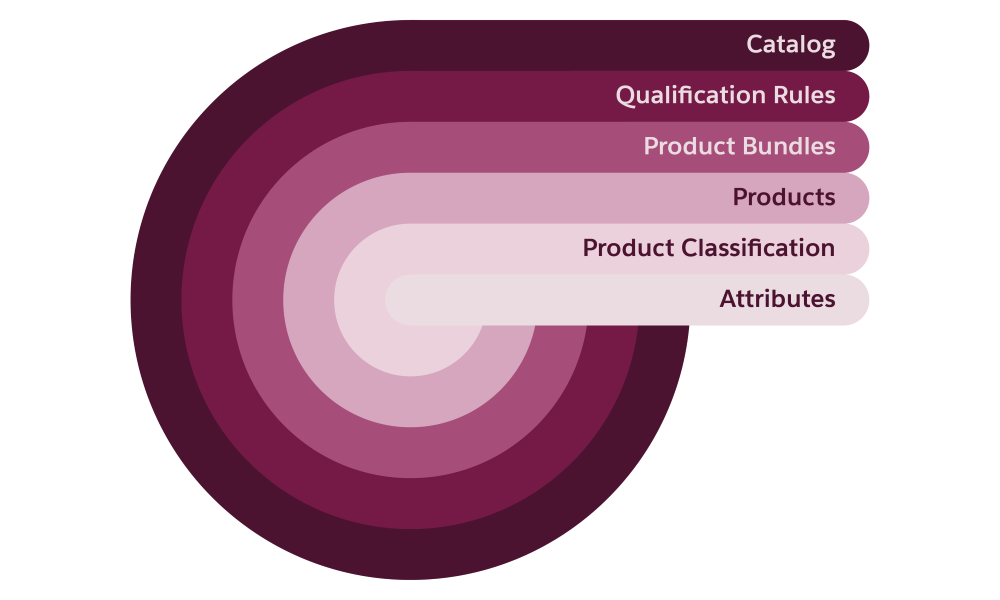
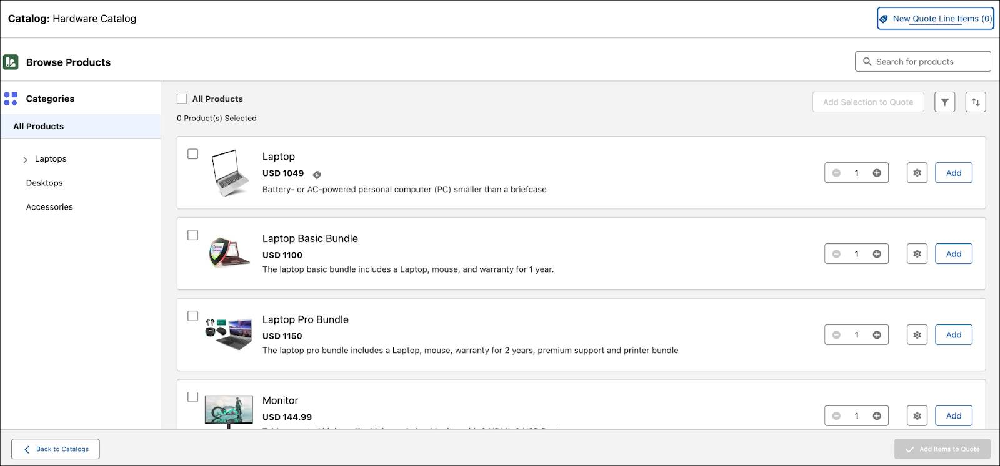
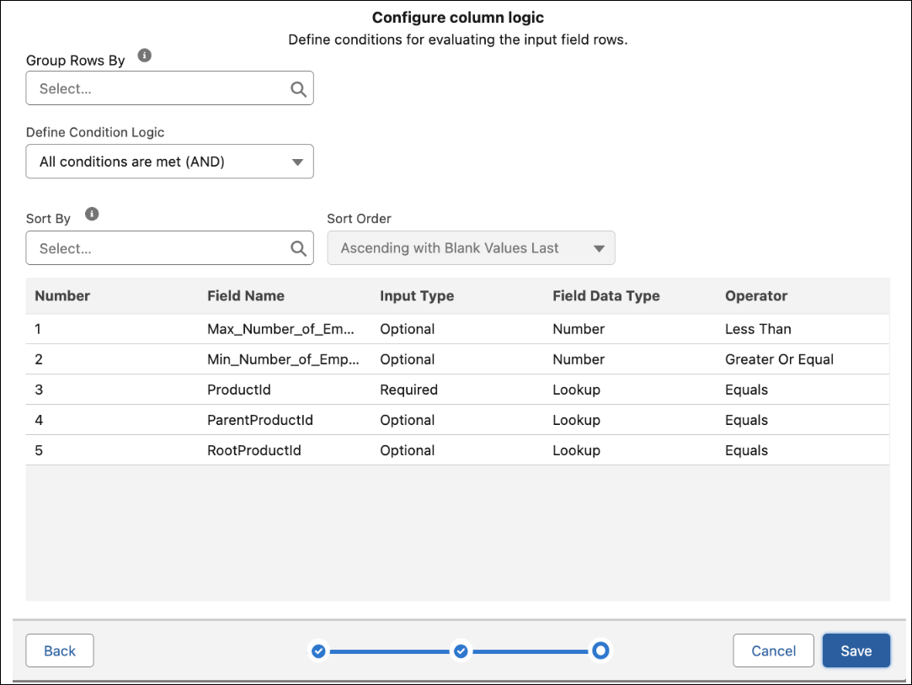

## Revenue Cloud Architecture
Revenue Cloud is a unified product-to-cash suite for omnichannel buying and selling. It’s made up of several components to support all stages of the sales cycle.

```mermaid
graph TD
    A[Revenue Cloud<br>Unified Product-to-Cash Suite] --> B[CPQ]
    A --> C[Billing]
    A --> D[Partner Relationship Management]
    A --> E[Subscriptions]
    A --> F[Sales Agreements]
    A --> G[Digital Channels<br>eCommerce, Self-service Portals]
    A --> H[Revenue Recognition]

    B --> I[Product Configuration]
    B --> J[Pricing Rules]
    B --> K[Quote Generation]

    C --> L[Invoicing]
    C --> M[Payment Collection]
    C --> N[Tax and Compliance]

    D --> O[Partner Onboarding]
    D --> P[Partner Quoting]

    E --> Q[Subscription Management]
    E --> R[Recurring Revenue]

    F --> S[Contract Terms]
    F --> T[Volume-Based Discounts]

    H --> U[Automated Revenue Schedules]
    H --> V[GAAP Compliance]

    style A fill:#e3f2fd,stroke:#1e88e5,stroke-width:2px
    style B fill:#fff3e0,stroke:#fb8c00,stroke-width:1.5px
    style C fill:#fff3e0,stroke:#fb8c00,stroke-width:1.5px
    style D fill:#fff3e0,stroke:#fb8c00,stroke-width:1.5px
    style E fill:#fff3e0,stroke:#fb8c00,stroke-width:1.5px
    style F fill:#fff3e0,stroke:#fb8c00,stroke-width:1.5px
    style G fill:#fff3e0,stroke:#fb8c00,stroke-width:1.5px
    style H fill:#fff3e0,stroke:#fb8c00,stroke-width:1.5px
```

 

## Product Catalog

- A great sales experience starts with a strong foundation: setting up the product catalog and defining pricing.

- Once the catalog is in place, customers and sales reps can easily create and submit quotes.

-  Quotes evolve into contracts and orders, bringing customer assets to life. 

- The last step ties it all together—generating invoices

Revenue Cloud streamlines the process so that everyone involved enjoys a seamless journey from start to finish.

## Product Catalog Management
-  Defines a shared catalog for storing product information.
- One we have the catalog, use Salesforce Pricing to price those products. 
    - For complex products, use **Product Configurator** to set them up to be configurable during product selection. 
    - Example: You can set up a phone such that customers can **configure it :**
    1. by selecting a specific color**
    2. by selecting storage capacity 
    during product selection.

## End Customers
- End users are typically 
  - customers 
  -  sales reps, 
- Browse the product catalog and select products to build a quote.

## Contracts
- With successful execution of contracts, automated processes efficiently turn quotes into orders and fulfill orders into assets. 

Shared catalog supports the amendment, renewal, and cancellation of quotes, orders, and contracts. 

## Invoice Management 
- monetizes sales through:
 1. invoice generation, including tax calculations for products and services delivered to customers.
 2.  All these Revenue Cloud components use the same product data from your product catalog.

## API
- Using APIs, you can automate business processes like complex product bundling and product configuration. Other cloud services can use these composable APIs to access Revenue Cloud features.

##  Invocable Actions
- use to create reusable actions
- encapsulate a process and can be invoked from various applications in the Salesforce environment and from external applications.

## Product Catalog Building Blocks

The setup process involves four main stages.

1. Define products and their attributes.
2. Create reusable product categories to classify products.
3. Build bundles and product offerings.
4. Configure rules to govern product visibility, packaging, and attribute configurations.

- Salesforce Pricing, Transaction Management, Dynamic Revenue Orchestrator, and Invoice Management use Shared Catalog

### How to start:
- Start by creating the **product catalog**, which is a container for all other objects
- Next create the product attributes
- Next create templates—called **product classifications**  to create product variations

Products can be simple stand-alone offerings or bundled products that offer flexibility and scalability in your go-to-market options.

###  Creating quotes
- Customers and sales reps can view products and product bundles,
    -  including product images, descriptions, product attributes, prices, and buying options in a single comprehensive view.
- A well-organized product-browsing experience makes it easy for sales reps and customers to efficiently identify the most suitable products.

## Qualification Rules and Product Visibility

Example: Different parts of the world use various types of power plugs (220v, 110v...)
- When a customer searches for power plugs in your catalog, they should see only **those relevant to their region** for the best shopping experience.

-  A **Qualification Rule** acts to **qualify or disqualify products** or product categories based on **different customer requirements**. With these rules in place, you ensure that the products shown to customers are **relevant**.

- **Product qualification** rules control which products and product categories are presented to which users for selection, based on a variety of conditions such as:
    - location
    - account attributes
    - customer type.

- You can qualify or disqualify specific products or entire product categories using qualification rules, which rely on different elements. 
    - These elements include:
        - objects
        - decision tables
        - qualification rule procedures
        - context definitions

## Decision Tables
✅ What Are Decision Tables?
Decision Tables are structured tools used to represent complex business logic in a simple, tabular format. Each row in the table represents a rule, and each column corresponds to a condition or action.

They help answer questions like:

"Given a customer's location and type, which products should be shown?"

🧠 How Decision Tables Work in Product Qualification
In Revenue Cloud (or CPQ systems), Decision Tables are used inside Qualification Rules to determine whether a product or category should be shown or hidden based on certain inputs (context).

🌍 Use Case: Power Plug Types by Region
Let’s say your company sells power plugs that differ by voltage:

110V (USA, Japan)

220V (India, UK, EU)

You want to ensure that:

Customers from India see only 220V plugs, and not irrelevant 110V plugs.

| Location | Customer Type | Product Category | Action     |
| -------- | ------------- | ---------------- | ---------- |
| USA      | Consumer      | 220V Plugs       | Disqualify |
| USA      | Consumer      | 110V Plugs       | Qualify    |
| India    | Business      | 220V Plugs       | Qualify    |
| India    | Business      | 110V Plugs       | Disqualify |

Each row is a rule evaluated based on the customer’s context.

### 🛠️ Elements That Make This Work
Context Definitions: Define what inputs (e.g., region, account type) are considered.

Objects: Such as Product, Account, User, etc.

Decision Tables: Define logic in a matrix form.

Qualification Rule Procedures: Invoke the decision table at runtime.

### ✅ Benefits of Using Decision Tables
Easy to maintain and scale product visibility logic

Reduces hard-coded conditions in scripts

Clear business-friendly representation

Supports multiple conditions and complex qualification logic

- In Salesforce, for example, decision tables can **calculate discounts** based on **certain product attributes**.
- Product Catalog Management uses decision tables to:
    -  define the criteria for qualifications and disqualifications of products and product categories.

## Objects in Product Catalog

| Object                        | Purpose                                   |
|-------------------------------|-------------------------------------------|
| ProductQualification          | Qualification rules for products          |
| ProductDisqualification       | Disqualification rules for products       |
| ProductCategoryQualification  | Qualification rules for product categories|
| ProductCategoryDisqualification | Disqualification rules for product categories|

## Data Model
- The Revenue Cloud data model is extensible to support different industries and unique business needs.
- Example:  if you’re defining product eligibility for accounts that operate in specific industries—communications, manufacturing, media, or finance
    - update the **Product Qualification object** and add a custom field.
    - In this scenario, you can add an **Operating_Industry__c** field of the data type Picklist. This information is used by other components involved in setting up Qualification Rules.

## References

- [Revenue Cloud Design](https://trailhead.salesforce.com/content/learn/modules/revenue-cloud-design/set-up-your-product-offerings)
