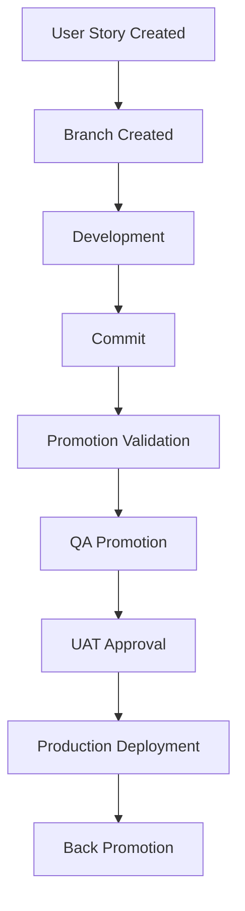
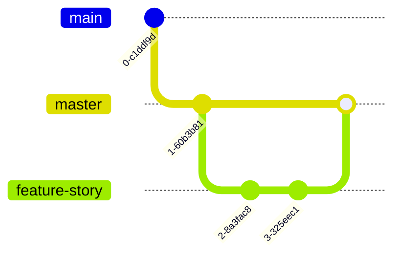
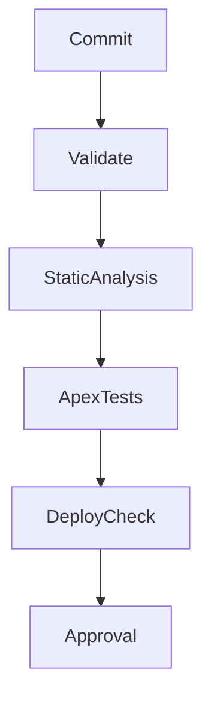
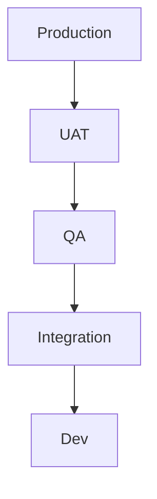

# Salesforce Release Management  
## Best Practices with Copado

### Enterprise DevOps for Salesforce

---

# Why Copado?

## Salesforce-Native DevOps Platform

Copado provides:

- Native Salesforce integration
- Story-driven development
- Automated CI/CD
- Environment promotion orchestration
- Compliance & auditability
- Intelligent merge conflict detection
- Quality gates
- Release governance

---

# Copado Release Lifecycle

---

# Story-Driven Development

## Copado Best Practice

Each work item should map to a **User Story**

Story contains:

- Requirement traceability
- Git branch
- Commits
- Validation status
- Deployment history
- Test execution results

### Never deploy unmanaged metadata changes

---

# Branching Strategy

## Recommended Copado Model

Best practices:

- One branch per story
- Short-lived branches
- Auto-prune merged branches
- Resolve conflicts early

---

# Environment Pipeline Design

## Typical Copado Pipeline

### Pipeline Rules

- Promotion validation enforced
- No bypass deployments
- Controlled promotion approvals

---

# Promotion Governance

## Controlled Promotion Flow

Each promotion should require:

✅ Validation success  
✅ Apex test pass  
✅ Code review approval  
✅ Metadata dependency check  
✅ User story completeness

Never promote partially completed stories.

---

# Continuous Integration Validation

## Copado CI Jobs

Automate:

- Metadata retrieval
- Static code analysis
- Apex execution
- Deployment simulation
- Dependency validation

---

# Quality Gates

## Enforce Deployment Standards

Recommended gates:

- PMD score threshold
- Apex coverage > 85%
- Security scan pass
- Naming convention validation
- Story completeness validation

Block deployment automatically if failed.

---

# Automated Testing Strategy

## Copado Testing Framework

Include:

- Apex unit tests
- Selenium UI tests
- Regression suites
- API validations

Execution stages:

- Commit validation
- QA promotion
- UAT approval
- Production readiness

---

# Back Promotion

## Critical Copado Practice

After production deployment:

Purpose:

- Prevent environment drift
- Keep metadata aligned
- Avoid future merge conflicts

---

# Merge Conflict Prevention

## Use Copado Smart Merge

Best Practices:

- Promote frequently
- Keep stories small
- Resolve conflicts immediately
- Validate merges before promotion

Avoid large feature accumulation.

---

# Compliance & Auditability

## Enterprise Governance

Copado tracks:

- Who deployed
- What changed
- Approval timestamps
- Test evidence
- Promotion approvals
- Deployment artifacts

Essential for:

- SOX
- HIPAA
- PCI
- Internal audits

---

# Release Scheduling

## Production Deployment Controls

Recommended windows:

- Fixed deployment schedule
- Emergency hotfix lane
- Freeze windows before major events

Example:

- Tuesday → Feature releases
- Friday → Hotfixes
- Emergency → Approval exception workflow

---

# Hotfix Workflow

## Copado Hotfix Best Practice

Rules:

- Separate hotfix stories
- Fast-track approvals
- Mandatory back promotion

---

# Common Copado Anti-Patterns

❌ Direct sandbox metadata edits  
❌ Long-lived stories  
❌ Manual production deployments  
❌ Skipping back promotion  
❌ Shared development branches  
❌ Ignoring validation failures  
❌ Large bundled promotions

---

# Key Metrics to Track

## Copado Operational KPIs

- Deployment success rate
- Story cycle time
- Failed validation %
- Merge conflict frequency
- Defect leakage to production
- Back promotion lag
- Approval SLA compliance

---

# Golden Rules for Copado Success

## Elite Salesforce Teams Follow These

1. Story-first development  
2. Automate validations  
3. Keep stories small  
4. Promote continuously  
5. Back promote always  
6. Enforce approvals  
7. Never bypass quality gates  
8. Audit everything  
9. Resolve conflicts early  
10. Measure and improve

---

# Final Takeaway

# Copado Success =

### Process Discipline  
+ Automation  
+ Governance  
+ Fast Feedback  
+ Continuous Improvement

---

# Questions?

## Thank You

### Salesforce DevOps Excellence with Copado
