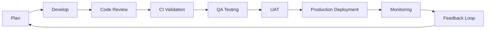
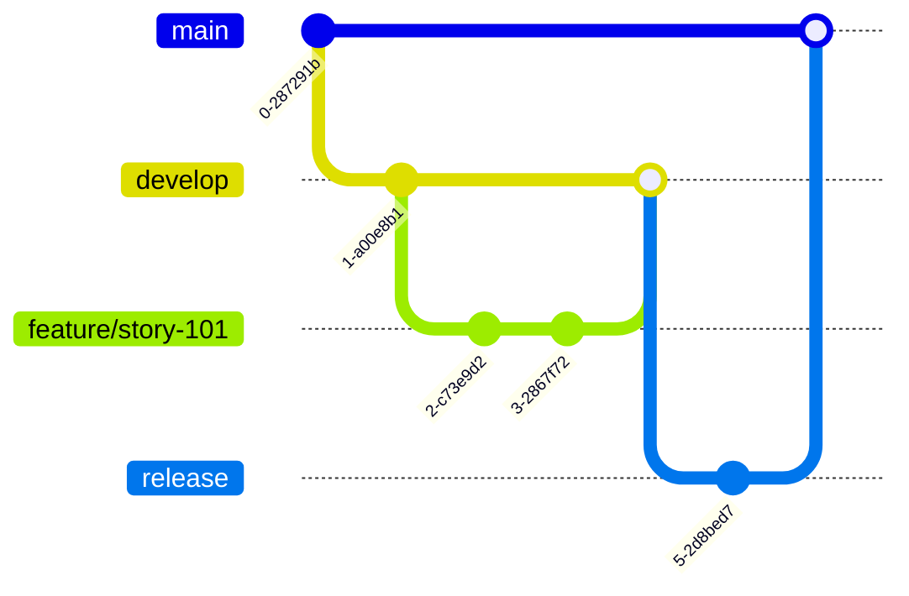
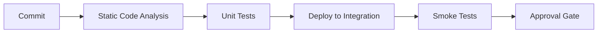
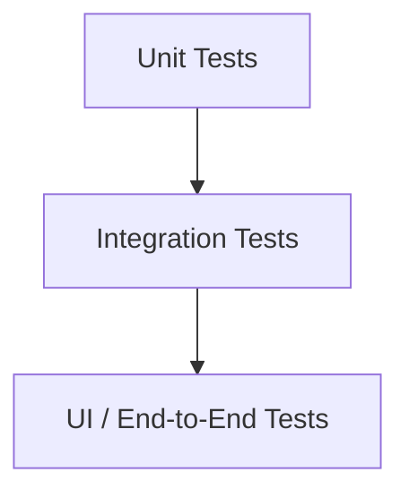
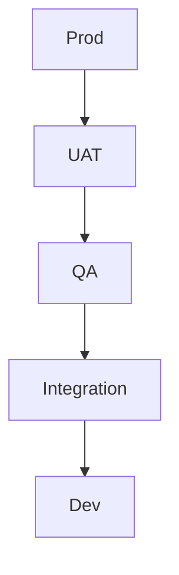

# Salesforce Release Management  
## Best Practices

### Building Reliable, Scalable, and Predictable Deployments

**Modern DevOps for Salesforce**

---

# Why Release Management Matters

## Challenges in Salesforce Delivery

- Metadata complexity
- Multiple sandboxes
- Parallel development
- Profile & permission conflicts
- Deployment failures
- Manual validation overhead
- Environment drift
- Limited rollback support

---

# Core Release Management Goals

## What Success Looks Like

✅ Predictable deployments  
✅ High deployment success rate  
✅ Faster release cycles  
✅ Reduced production defects  
✅ Strong governance  
✅ Better developer collaboration  
✅ Auditability and compliance

---

# Release Management Lifecycle



---

# Branching Strategy

## Use Git as Source of Truth

### Recommended Model



### Best Practices

- Story-based branches
- Short-lived branches
- Pull request reviews
- Mandatory merge validation

---

# Sandbox Strategy

## Environment Separation

| Environment | Purpose |
|------------|---------|
| Developer Sandbox | Individual development |
| Dev Integration | Merge validation |
| QA Sandbox | Functional testing |
| UAT Sandbox | Business validation |
| Staging | Production simulation |
| Production | Live environment |

### Rules

- Avoid direct changes outside source control
- Refresh regularly
- Document refresh schedule

---

# CI/CD Automation

## Automate Everything Possible

### CI Pipeline



### Tools

- GitHub Actions
- GitLab CI
- Jenkins
- Copado
- Gearset
- AutoRABIT
- Salesforce DevOps Center

---

# Quality Gates

## Never Skip Validation

### Minimum Checks

- PMD / static analysis
- Apex test coverage > 85%
- Security scans
- Metadata dependency validation
- LWC linting
- Deployment dry-run validation

---

# Testing Strategy

## Shift Left Testing

### Pyramid Model



### Best Practices

- Apex unit tests
- Jest for LWCs
- API integration validation
- Regression automation

---

# Deployment Governance

## Controlled Production Releases

### Recommended Release Windows

- Scheduled deployments
- Freeze periods before major business events
- CAB approval gates

### Checklist

- Release notes completed
- Rollback plan defined
- Monitoring enabled
- Stakeholders notified

---

# Back Promotion Strategy

## Keep Lower Environments Synced



### Why It Matters

- Prevent drift
- Preserve production fixes
- Reduce merge conflicts

---

# Change Intelligence

## Understand Dependencies

Track:

- Apex dependencies
- Flow dependencies
- Permission dependencies
- Profile impacts
- Object/field references

Use dependency-aware deployment tooling.

---

# Security & Compliance

## Enterprise Controls

Required:

- Role-based deployment access
- Audit trails
- Segregation of duties
- Approval workflows
- Artifact retention
- Release documentation

---

# Monitoring After Deployment

## Observe Production Health

Track:

- Apex exceptions
- Flow failures
- API failures
- Performance degradation
- User-reported issues

Tools:

- Salesforce Event Monitoring
- Splunk
- Datadog
- New Relic

---

# Incident Recovery

## Always Have Rollback Strategy

Options:

- Quick revert deployment
- Git rollback
- Metadata backup restore
- Feature toggles
- Hotfix branch workflow

---

# Metrics That Matter

## Measure Release Performance

Track:

- Deployment success rate
- Mean time to recovery
- Lead time for changes
- Change failure rate
- Defect escape rate

These align with **DORA metrics**

---

# Common Anti-Patterns

❌ Direct production changes  
❌ Long-lived branches  
❌ Manual deployments  
❌ No rollback plan  
❌ Shared developer sandboxes  
❌ Skipping validation tests  
❌ Poor documentation  
❌ Environment drift

---

# Recommended Tooling Stack

## Enterprise Salesforce DevOps

**Source Control**  
GitHub / GitLab / Bitbucket

**CI/CD**  
Jenkins / GitHub Actions / Copado / Gearset

**Code Quality**  
PMD / ESLint / SonarQube

**Testing**  
Apex / Jest / Selenium / Cypress

**Monitoring**  
Splunk / Datadog / Salesforce Event Monitoring

---

# Golden Rules

## The 10 Commandments

1. Source control everything  
2. Automate deployments  
3. Test early  
4. Deploy often  
5. Keep branches short-lived  
6. Never skip reviews  
7. Document every release  
8. Monitor production  
9. Plan rollback  
10. Continuously improve

---

# Final Takeaway

# Great Salesforce Release Management =

### Automation  
+ Governance  
+ Testing  
+ Visibility  
+ Fast Recovery

## This is how elite Salesforce teams ship safely at scale.

---

# Questions?

### Thank You
**Salesforce Release Excellence Starts with Discipline**
````

