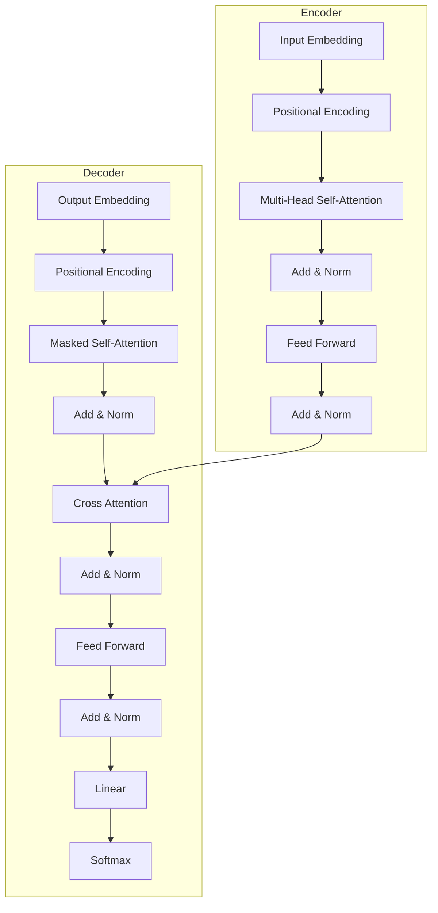
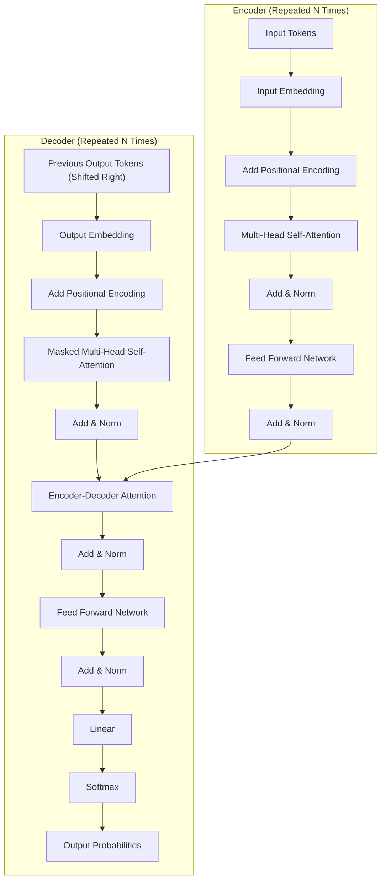
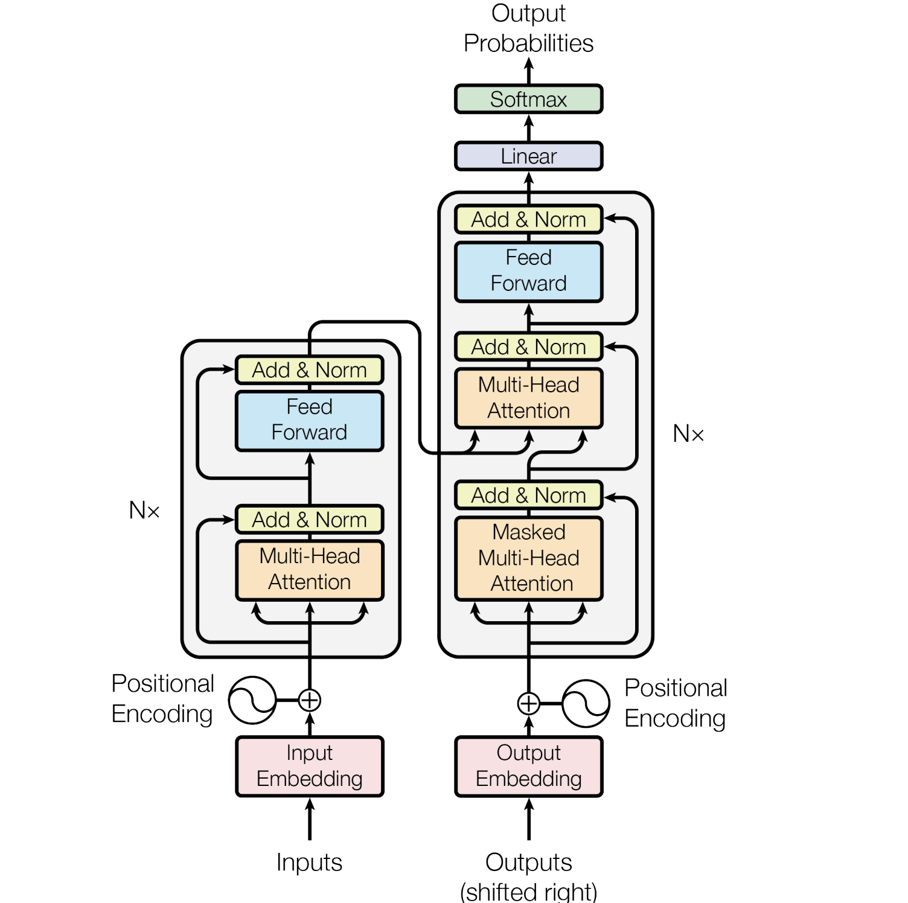

## Attention

- Fundamental constraint in recurrent models
    - sequential computation,
- Allows modeling of dependencies without regard to their distance in the input or output sequences

## Transformer

- instead relying entirely on an attention mechanism to draw global dependencies between input and output.

- The Transformer allows for significantly more parallelization and can reach a new state of the art in
translation quality after being trained for as little as twelve hours on eight P100 GPUs.

-  operations required to relate signals from two arbitrary input or output positions grows
in the distance between positions, linearly for ConvS2S and logarithmically for ByteNet. This makes
it more difficult to learn dependencies between distant positions 

 In the Transformer this is
reduced to a constant number of operations, albeit at the cost of reduced effective resolution due
to averaging attention-weighted positions, an effect we counteract with Multi-Head Attention

## Self-attention

-  sometimes called intra-attention is an attention mechanism relating different positions
of a single sequence in order to compute a representation of the sequence.

Self-attention has been
used successfully in a variety of tasks including reading comprehension, abstractive summarization,
textual entailment and learning task-independent sentence representations

Transformer is the first transduction model relying
entirely on self-attention to compute representations of its input and output without using sequencealigned RNNs or convolution.

A transduction model is a machine learning model that learns a direct mapping from an input sequence to an output sequence, without explicitly modeling the underlying structure or generating intermediate symbolic representations.

The term "transduction" comes from the idea of transforming one structured object into another.

Input  ─────────────► Model ─────────────► Output
French sentence                      English sentence

## Encode 
The encoder maps an input sequence of symbol representations (x1, ..., xn) to a sequence
of continuous representations z = (z1, ..., zn). 

Given z, the decoder then generates an output
sequence (y1, ..., ym) of symbols one element at a time.

At each step the model is auto-regressive, consuming the previously generated symbols as additional input when generating the next.

                    TRANSFORMER ARCHITECTURE
                 (Encoder-Decoder Transformer)

                                  Output Probabilities
                                           ▲
                                      ┌─────────┐
                                      │ Softmax │
                                      └────▲────┘
                                           │
                                      ┌─────────┐
                                      │ Linear  │
                                      └────▲────┘
                                           │
               ┌──────────────────────────────────────────────┐
               │                 DECODER (×N)                 │
               │                                              │
               │  ┌───────────────────────────────────────┐   │
               │  │ Add & Norm                            │   │
               │  ├───────────────────────────────────────┤   │
               │  │ Feed Forward Network                  │   │
               │  ├───────────────────────────────────────┤   │
               │  │ Add & Norm                            │   │
               │  ├───────────────────────────────────────┤   │
               │  │ Encoder-Decoder Attention             │◄──┼───────────── Encoder Output
               │  ├───────────────────────────────────────┤   │
               │  │ Add & Norm                            │   │
               │  ├───────────────────────────────────────┤   │
               │  │ Masked Self-Attention                 │   │
               │  └───────────────────────────────────────┘   │
               └──────────────────────────────────────────────┘
                             ▲
                             │
                Positional Encoding
                             ▲
                             │
                     Output Embedding
                             ▲
                             │
                  Previous Output Tokens
                     (Shifted Right)

## Encoder
               ┌──────────────────────────────────────────────┐
               │                 ENCODER (×N)                 │
               │                                              │
               │  ┌───────────────────────────────────────┐   │
               │  │ Add & Norm                            │   │
               │  ├───────────────────────────────────────┤   │
               │  │ Feed Forward Network                  │   │
               │  ├───────────────────────────────────────┤   │
               │  │ Add & Norm                            │   │
               │  ├───────────────────────────────────────┤   │
               │  │ Multi-Head Self-Attention             │   │
               │  └───────────────────────────────────────┘   │
               └──────────────────────────────────────────────┘
                             ▲
                             │
                Positional Encoding
                             ▲
                             │
                      Input Embedding
                             ▲
                             │
                        Input Tokens

## Simplified

    Input Tokens
      │
      ▼
Input Embedding
      │
      ▼
+ Positional Encoding
      │
      ▼
Encoder Stack (N Layers)
      │
      ▼
Encoder Output
      │
      ├──────────────────────────────┐
      │                              │
      ▼                              ▼
                            Decoder Cross Attention
                                      ▲
                                      │
Previous Output Tokens                │
      │                               │
      ▼                               │
Output Embedding                      │
      │                               │
      ▼                               │
+ Positional Encoding                 │
      │                               │
      ▼                               │
Masked Self-Attention ────────────────┘
      │
      ▼
Cross Attention
      │
      ▼
Feed Forward
      │
      ▼
Linear
      │
      ▼
Softmax
      │
      ▼
Next Token Probability

The Transformer follows this overall architecture using stacked self-attention and point-wise, fully
connected layers for both the encoder and decoder

Encoder: The encoder is composed of a stack of N = 6 identical layers. Each layer has two
sub-layers. The first is a multi-head self-attention mechanism, and the second is a simple, positionwise fully connected feed-forward network. 

We employ a residual connection  around each of
the two sub-layers, followed by layer normalization.

That is, the output of each sub-layer is
LayerNorm(x + Sublayer(x)), where Sublayer(x) is the function implemented by the sub-layer
itself. To facilitate these residual connections, all sub-layers in the model, as well as the embedding
layers, produce outputs of dimension dmodel = 512.

Decoder: The decoder is also composed of a stack of N = 6 identical layers. In addition to the two
sub-layers in each encoder layer, the decoder inserts a third sub-layer, which performs multi-head
attention **over the output of the encoder stack**. 

Similar to the encoder, we employ residual connections
around each of the sub-layers, followed by layer normalization. We also modify the self-attention
sub-layer in the decoder stack to prevent positions from attending to subsequent positions. This
**masking**, combined with fact that the output embeddings are offset by one position, ensures that the
predictions for position i can depend only on the known outputs at positions less than i.

## Attention
An attention function can be described as mapping a query (Q) and a set of key-value (K-V) pairs to an output,
where the query, keys, values, and output are all vectors. The output is computed as a weighted sum of the values, where the weight assigned to each value is computed by a compatibility function of the
query with the corresponding key.

