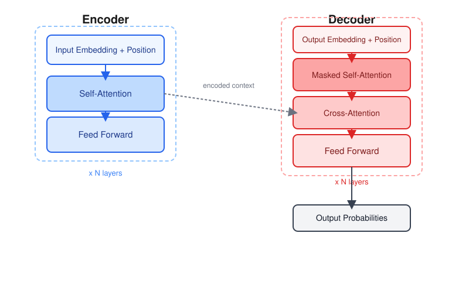
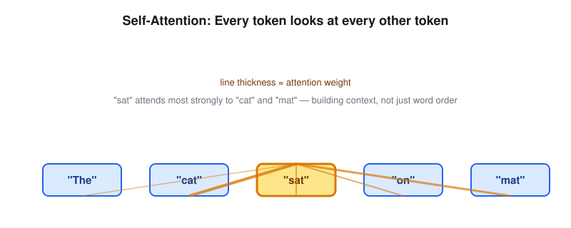
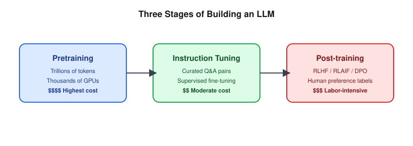
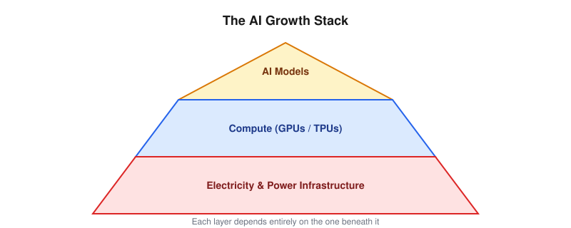
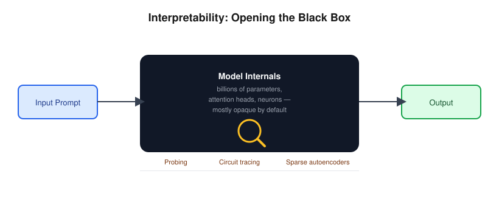
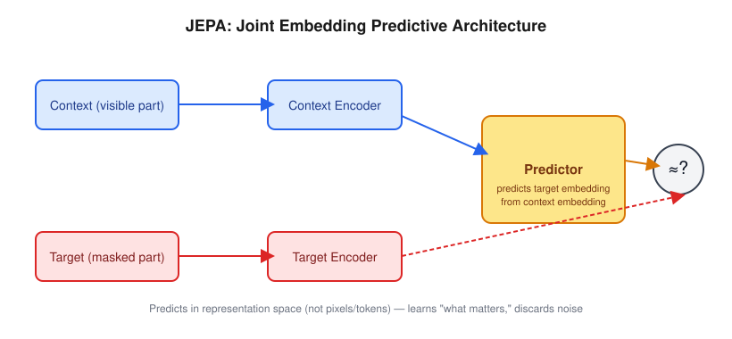

# From Transformers to AGI
### Understanding the Architecture, Economics, and Future of Large Language Models

*A Technical Lecture*

---

## Agenda

1. How we arrived at the Transformer architecture
2. How LLMs solve real-world problems today
3. The cost of pretraining, post-training & instruction tuning
4. The cost of inference
5. Why electricity & compute are the real bottlenecks for AI growth
6. LLM interpretability — current status and open issues
7. Path to AGI — what JEPA can offer

---

# 1. The Road to Transformers

---

## Before Transformers: A Quick History

- **Rule-based NLP (1950s–1980s)** — hand-crafted grammar rules, no learning
- **Statistical NLP (1990s–2000s)** — n-gram models, HMMs, probabilistic parsing
- **RNNs / LSTMs (2000s–2014)** — sequential processing, could "remember" context but struggled with long-range dependencies
- **Seq2Seq + Attention (2014–2016)** — encoder-decoder models for translation; attention lets the decoder "look back" at relevant input tokens

---

## The Bottleneck Before 2017

- RNNs process tokens **one at a time** → slow, hard to parallelize
- Long sequences suffer from **vanishing gradients**
- Attention helped, but was still bolted onto a sequential backbone
- Researchers asked: *what if attention was the entire architecture?*

---

## "Attention Is All You Need" (2017)

- Google Brain paper introduces the **Transformer**
- Key ideas:
  - **Self-attention** — every token attends to every other token directly
  - **Positional encoding** — injects order information since there's no recurrence
  - **Fully parallelizable** — enables training on massive datasets with GPUs/TPUs
  - **Multi-head attention** — captures different types of relationships simultaneously

---

## The Transformer Architecture

---

## Why It Won

- Removed sequential bottleneck → training scales with hardware
- Enabled **scaling laws**: more data + more parameters + more compute = predictably better performance
- Led directly to BERT (2018), GPT series, T5, and eventually today's frontier LLMs
- Architecture proved general enough for text, code, images, audio, and multimodal fusion

---

# 2. How LLMs Solve Problems Today

---

## From Text Prediction to Task Execution

- Core mechanism is still **next-token prediction** — but at scale, this becomes emergent reasoning
- Modern LLMs solve problems via:
  - **In-context learning** — few-shot examples in the prompt
  - **Chain-of-thought reasoning** — step-by-step problem decomposition
  - **Tool use / function calling** — calling APIs, code execution, search
  - **Agentic workflows** — planning, acting, observing, replanning (loops)
  - **Retrieval-Augmented Generation (RAG)** — grounding answers in external knowledge

---

## Where LLMs Are Winning Today

- Code generation & debugging
- Document summarization & extraction
- Customer support & conversational agents
- Structured data transformation (e.g., Salesforce/CRM workflows, Agentforce-style automation)
- Research assistance, drafting, translation

## Where They Still Struggle

- Long-horizon planning and reliability
- Factual grounding without hallucination
- True causal/world-model reasoning (more on this in JEPA section)

---

# 3. The Cost of Training

---

## Three Stages of Building an LLM

| Stage | What Happens | Relative Cost |
|---|---|---|
| **Pretraining** | Learn language/world patterns from trillions of tokens | Highest ($M–$100M+) |
| **Instruction Tuning (SFT)** | Teach the model to follow instructions using curated Q&A pairs | Moderate |
| **Post-training (RLHF/RLAIF/DPO)** | Align outputs with human preferences, safety, style | Moderate–High (labeling is expensive) |

---

## Pretraining Cost Drivers

- **Compute**: thousands of GPUs/TPUs running for weeks to months
- **Data pipeline**: curation, deduplication, filtering of trillions of tokens
- **Energy**: megawatt-scale power draw for the training cluster
- **Failure recovery**: checkpointing, hardware failures at scale add real overhead
- Frontier-model pretraining runs are estimated in the tens to hundreds of millions of dollars in compute alone

---

## Post-Training Cost Drivers

- **Human feedback labeling** — annotators ranking/rating outputs (expensive, slow, hard to scale)
- **Reward model training** — a second model trained to score outputs
- **RL fine-tuning loops** (RLHF/RLAIF/DPO) — iterative, computationally lighter than pretraining but operationally complex
- Smaller in raw compute than pretraining, but **much more labor-intensive**

---

# 4. The Cost of Inference

---

## Why Inference Cost Matters More Over Time

- Pretraining is a **one-time** cost; inference is **recurring** and scales with usage
- At high volume, cumulative inference cost can exceed training cost
- Cost drivers:
  - Model size (parameters) → memory & compute per token
  - Context window length → attention cost grows with sequence length
  - Output length → autoregressive generation is sequential, token by token

---

## Techniques to Reduce Inference Cost

- **Quantization** (INT8/INT4) — smaller memory footprint, faster compute
- **KV-caching** — avoid recomputing attention for prior tokens
- **Speculative decoding** — small "draft" model proposes tokens, large model verifies
- **Mixture-of-Experts (MoE)** — only activate a subset of parameters per token
- **Model distillation** — smaller models trained to mimic larger ones
- **Batching & hardware-aware serving** (e.g., vLLM, TensorRT-LLM)

---

# 5. Electricity & Compute: The Real Bottleneck

---

## Compute as the New Oil

- GPU/TPU availability is often the **limiting factor**, not algorithms or data
- Demand for AI accelerators (NVIDIA H100/B200, Google TPUs, AWS Trainium) far outpaces supply
- Data center buildouts now compete directly with national power grids

---

## Electricity: The Hidden Constraint

- Training clusters draw **tens to hundreds of megawatts**
- Inference at global scale is a **continuous, always-on** power draw
- Data centers are increasingly sited near:
  - Cheap/abundant power (hydro, nuclear, natural gas)
  - Favorable climates (reduces cooling cost)
- Major AI labs are now signing **direct power purchase agreements**, including nuclear (SMRs)

---

## Why This Shapes AI's Future

- Compute + energy availability may determine **who can train frontier models**, not just algorithmic innovation
- Efficiency research (smaller models, better architectures) is partly a response to this constraint
- Geopolitics of chips (export controls) and energy policy are now AI policy

---

# 6. LLM Interpretability

---

## What "Interpretability" Means Here

- LLMs are famously **black boxes** — we know the math, not *why* a given output emerges
- Goal: understand what's happening **inside** the model, not just observe input/output behavior
- Two broad approaches:
  - **Behavioral / black-box** — probing via inputs and outputs, without touching internals
  - **Mechanistic interpretability** — reverse-engineering the actual computation: neurons, attention heads, "circuits"

---

## Current Techniques

- **Probing classifiers** — train a small model to detect if a concept (e.g., sentiment, syntax) is encoded in a hidden layer
- **Attention visualization** — inspecting which tokens attend to which (useful, but not the whole story)
- **Circuit tracing** — identifying small sub-networks responsible for a specific behavior (e.g., indirect object identification)
- **Sparse autoencoders (SAEs)** — decompose dense neuron activations into human-interpretable "features"
- **Activation steering** — directly editing internal activations to causally test what a feature does

---

## Current Status

- Still an early, fast-moving research field — not yet mature enough for full guarantees
- Anthropic, DeepMind, and academic labs have made real progress on **feature-level** and **circuit-level** understanding in smaller/mid-size models
- Frontier-scale models remain only **partially** interpretable — most "reasoning" is still not fully traceable
- Growing overlap with **AI safety**: interpretability is seen as key to catching deception, misalignment, or unsafe behavior before deployment

---

## Open Issues

- **Scale** — techniques that work on small models often don't scale cleanly to frontier-size models
- **Superposition** — individual neurons often encode *multiple* unrelated concepts at once, making clean decomposition hard
- **No ground truth** — for many "features" found, we can't fully verify our interpretation is correct
- **Cost** — interpretability research is compute- and labor-intensive, competing for resources against capability-focused work
- **Actionability gap** — even when we *see* a problematic circuit, reliably intervening on it without breaking other behavior is unsolved

---

# 7. Path to AGI — What JEPA Offers

---

## Why Current LLMs May Not Be Enough

- LLMs are fundamentally **next-token predictors** over language
- Criticism (notably from Yann LeCun): they lack a genuine **world model**
- They struggle with:
  - Physical/spatial reasoning
  - Long-horizon planning
  - Learning efficiently from limited data (unlike humans/animals)

---

## What Is JEPA?

**Joint Embedding Predictive Architecture**

- Instead of predicting raw pixels/tokens, JEPA predicts **abstract representations** of missing information
- Learns to model *what matters* about the world, discarding irrelevant detail (e.g., exact pixel noise)
- Trained via self-supervised learning, comparing predicted vs. actual embeddings in representation space

---

## Why This Matters for AGI

- Aims to build genuine **world models** — understanding cause, effect, and physical plausibility
- More sample-efficient than pure generative prediction
- Better suited for **planning and reasoning about the physical world**, not just language
- Represents a candidate path beyond pure LLM scaling — architecture-level innovation rather than just "bigger model"

---

## The Broader AGI Landscape

- **Scaling LLMs** — continued gains from data/compute, but diminishing returns debated
- **Agentic systems** — LLMs + tools + memory + planning loops
- **World models (JEPA-style)** — grounding in physical/causal understanding
- **Neurosymbolic hybrids** — combining learned representations with structured reasoning
- Most researchers believe AGI will require **combining these approaches**, not one silver bullet

---

# Summary

1. Transformers won because they parallelize and scale
2. LLMs solve problems via emergent reasoning, tools, and agentic loops
3. Training cost is dominated by pretraining compute; post-training is labor-intensive
4. Inference cost compounds at scale — efficiency techniques matter
5. Electricity and compute availability are now the primary growth constraint
6. Interpretability is progressing but still immature at frontier scale — key to trust and safety
7. AGI likely needs architectures beyond next-token prediction — JEPA is one promising direction

---

# Thank You / Q&A
