## Slide 1 — The Astonishing Idea: Predict the Next Word

> **What if we simply ask a machine:**
>
> **“What comes next?”**

That sounds almost trivial.

Yet this deceptively simple objective became one of the most important ideas in modern AI.

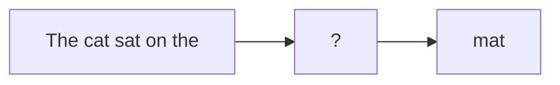

### The big question

**How can predicting the next token lead to an AI that can write, code, reason, translate, summarize, and converse?**

---

## Slide 2 — My Ceylon Radio Memory 📻

When I was growing up in India, I listened to **Ceylon Radio**.

There were programs where the host would play or sing part of a song.

Then came the challenge:

> **“What comes next?”**

The contestant had to continue the song.

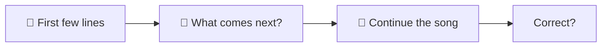

The better you knew the song, the better you could predict what came next.

---

## Slide 3 — Ceylon Radio → LLM

Here is the beautiful connection.

### Human

> “What comes next in this song?”

### Language Model

> “What token comes next in this text?”

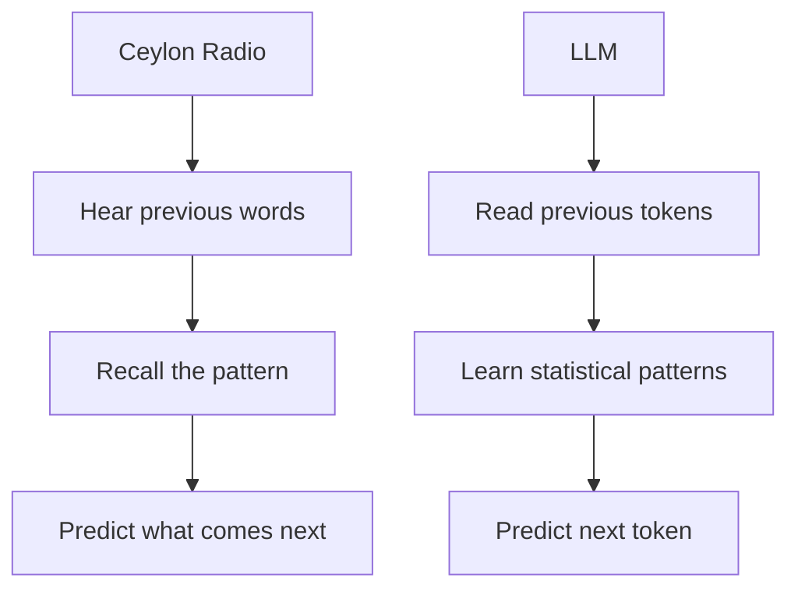

Different technology.

**Surprisingly similar intuition.**

---

## Slide 4 — What Is a Token?

An LLM doesn't literally see English words.

It sees **tokens**.

For example:

```text
"The cat is sleeping."
```

might become something conceptually like:

```text
["The", " cat", " is", " sleeping", "."]
```

The model repeatedly asks:

> **Given everything I have seen so far, what token is most likely to come next?**

---

## Slide 5 — The Next-Token Prediction Game

Imagine:

```text
The capital of France is
```

The model calculates probabilities:

```text
Paris       → 0.94
London      → 0.01
Berlin      → 0.01
Madrid      → 0.01
...
```

Then it chooses or samples a token.

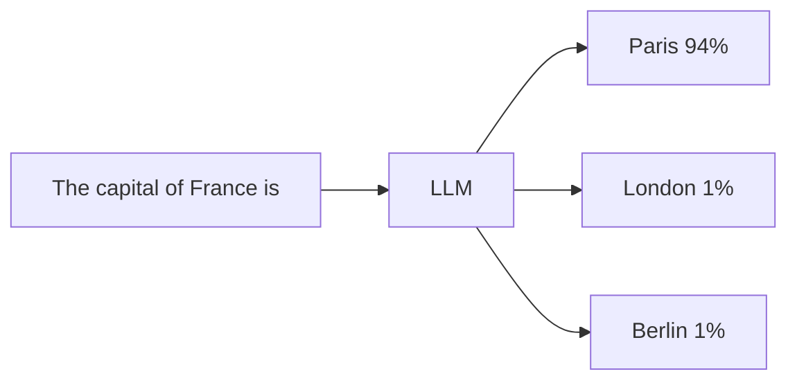

**One token at a time.**

---

## Slide 6 — And Then It Does It Again

After predicting:

```text
The capital of France is Paris
```

the model predicts the next token.

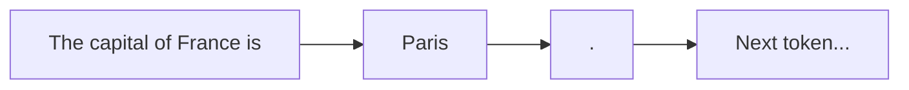

Generation becomes:

```text
token → token → token → token → ...
```

### This simple loop is incredibly powerful.

---

## Slide 7 — The Training Trick

Suppose our training text contains:

```text
The cat sat on the mat.
```

We can create many training examples:

| Input | Target |
|---|---|
| The | cat |
| The cat | sat |
| The cat sat | on |
| The cat sat on | the |
| The cat sat on the | mat |

The model learns:

> **Given the context, predict the next token.**

---

## Slide 8 — Billions of Examples

Now imagine doing this with:

- Books
- Web pages
- Articles
- Documentation
- Code
- Conversations
- Scientific papers
- Many other text sources

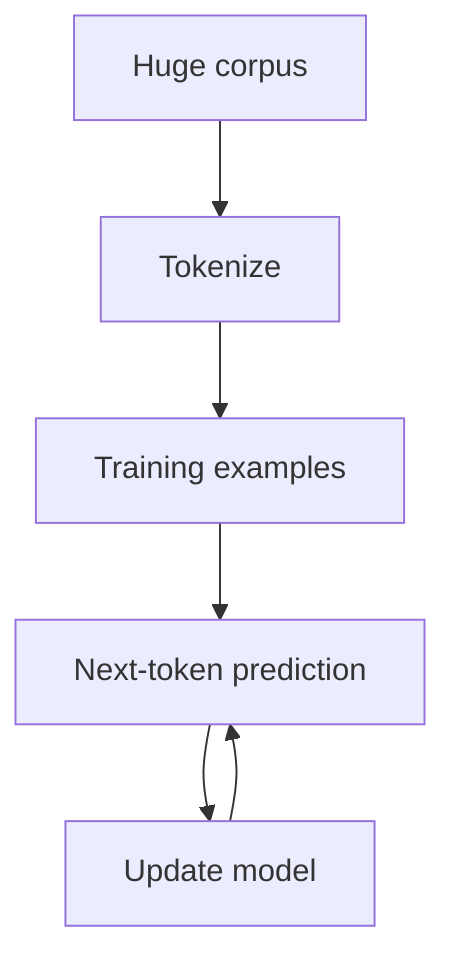

Repeat this **billions or trillions of times**.

That is the foundation of **pre-training**.

---

## Slide 9 — Pre-Training

### Pre-training objective

> **Predict the next token.**

The model starts with essentially random parameters.

Then:

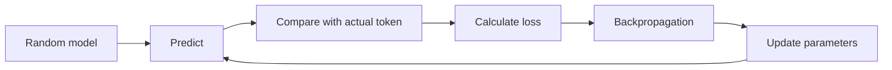

Over enormous amounts of data:

**the model learns language.**

---

## Slide 10 — What Does the Model Actually Learn?

We did not explicitly program:

```text
English grammar
+
facts
+
coding
+
style
+
reasoning patterns
```

Instead, the model discovers statistical structure from the training data.

It learns patterns such as:

```text
syntax
semantics
facts
relationships
style
code patterns
languages
```

### Nobody wrote these rules by hand.

**They emerged through training.**

---

## Slide 11 — The Strange Emergence

At first:

```text
random → nonsense
```

Then:

```text
training → better predictions
```

Eventually:

```text
context → surprisingly meaningful continuation
```

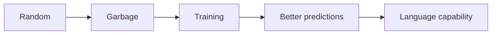

And this is where things get interesting.

---

## Slide 12 — “Wait… This Is More Than Autocomplete”

Initially, next-token prediction sounds like:

> **Fancy autocomplete.**

But something unexpected happens.

A sufficiently capable model can produce:

- essays
- programs
- explanations
- translations
- summaries
- stories
- structured data

### How did a simple objective produce all this?

**Scale.**

---

## Slide 13 — Scaling: Bigger Became Better

A major empirical discovery:

> **Larger models trained with more data and more compute tend to become more capable.**

Think:

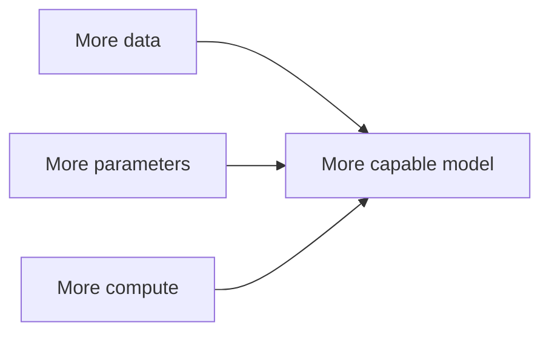

### The recipe

**Data + Parameters + Compute → Capability**

---

## Slide 14 — The Scaling Journey

We kept making models:

```text
small
  ↓
larger
  ↓
much larger
  ↓
enormous
```

And feeding them:

```text
more text
+
more examples
+
more compute
```

The models became increasingly capable.

### “Bigger is better” became an important engineering principle.

But there was a catch.

---

## Slide 15 — More Knowledge ≠ Better Assistant

A giant pretrained model may know an incredible amount.

But ask:

> **“Help me write a polite email declining this meeting.”**

A raw pretrained model isn't necessarily thinking:

> “I am your assistant. I should understand your intent and help you.”

It is fundamentally trying to continue text.

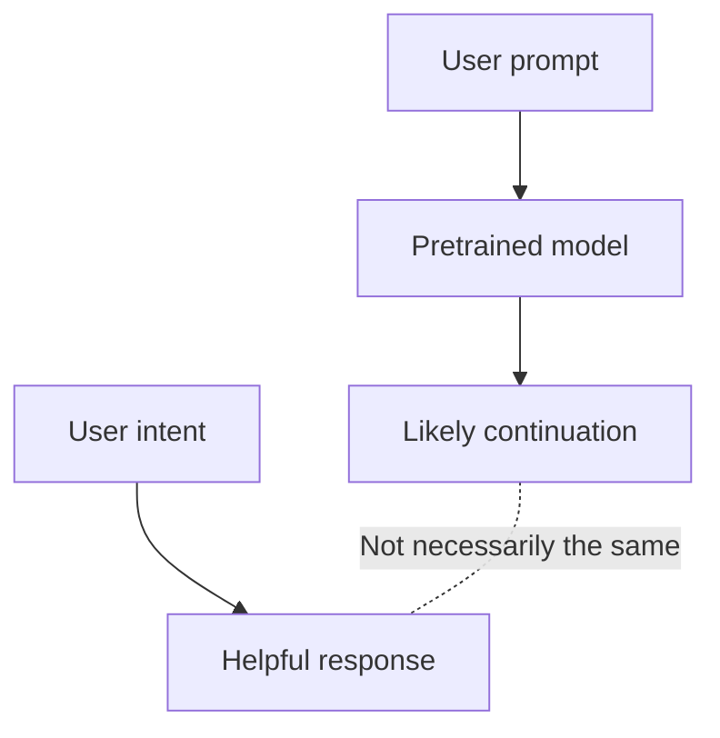

### Capability ≠ Alignment

---

## Slide 16 — The “Raw LLM” Problem

Imagine a powerful model that has read the internet.

You ask:

> **“What should I do about this problem?”**

It might produce something plausible.

But it may:

- misunderstand the intent
- be verbose
- ignore instructions
- continue the wrong pattern
- produce unsafe content
- answer a different question

### It knows a lot.

**But it doesn't automatically know how to be a good assistant.**

---

## Slide 17 — The Parrot Analogy 🦜

A pretrained LLM is sometimes described as a sophisticated **parrot**.

That's an oversimplification—but it is useful pedagogically.

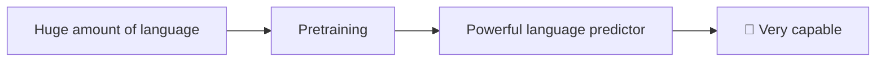

The model has learned an extraordinary amount.

But:

> **Who taught the parrot what humans actually want?**

That's where **post-training** enters.

---

## Slide 18 — Pre-Training vs Post-Training

### Pre-training

> **“Predict the next token.”**

### Post-training

> **“Behave in a way that is useful to people.”**

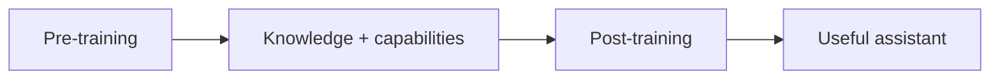

This distinction is fundamental.

---

## Slide 19 — Supervised Fine-Tuning

One early post-training technique:

### Give the model examples.

```text
USER:
Explain gravity to a 10-year-old.

ASSISTANT:
Imagine Earth is like a giant magnet...
```

We provide many examples of:

```text
instruction → desirable response
```

The model learns to follow this style.

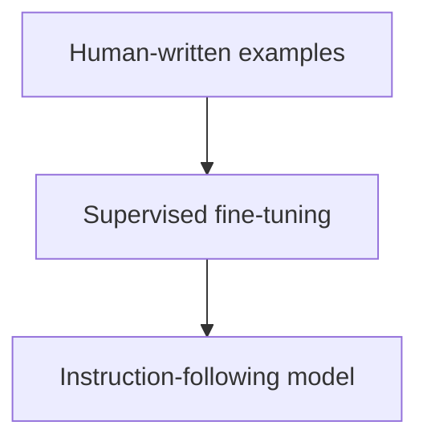

---

## Slide 20 — But Who Decides Which Answer Is Better?

Consider two responses:

### Response A

> “Gravity is a fundamental interaction…”

### Response B

> “Imagine Earth is pulling everything toward it…”

Both may be correct.

But which is **better for the user**?

This introduces a new question:

> **How do we teach a model human preferences?**

---

## Slide 21 — Human Feedback

Humans can compare responses.

```text
Prompt:
Explain gravity to a child.
```

The model generates:

```text
Response A
Response B
Response C
```

A human might rank:

```text
B > A > C
```

Now we have something extremely valuable:

### **Human preference data**

---

## Slide 22 — RLHF

**RLHF = Reinforcement Learning from Human Feedback**

The basic idea:

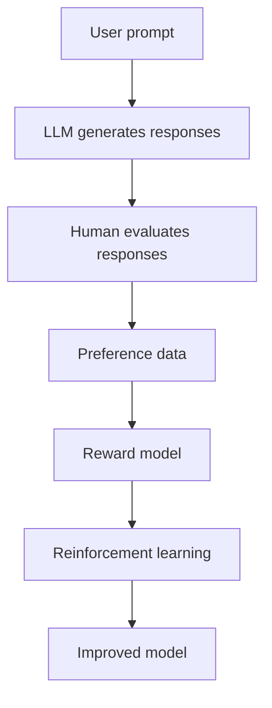

The model is optimized toward responses humans prefer.

---

## Slide 23 — From “What Comes Next?” to “What Should I Say?”

This is the conceptual transformation.

### Pre-training

```text
“What token comes next?”
```

### Post-training / RLHF

```text
“What response is useful,
helpful, and preferred by humans?”
```

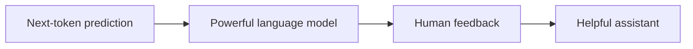

### Same underlying language model.

**Different objective for behavior.**

---

## Slide 24 — The Amazing Journey

Let's look at the whole story:

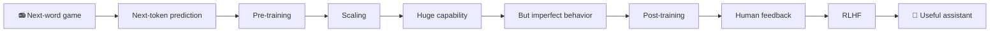

From a seemingly simple idea:

> **Predict what comes next**

we arrived at:

> **A conversational AI assistant.**

---

## Slide 25 — The Question We Leave for the Next Lecture

We have now seen:

```text
Next-token prediction
        ↓
Pre-training
        ↓
Scaling
        ↓
Large language models
        ↓
Post-training
        ↓
Human feedback
        ↓
RLHF
```

But there is a fascinating question:

> **What is actually happening inside the Transformer?**

How can a collection of matrix multiplications learn:

- language
- relationships
- context
- concepts
- attention
- surprisingly complex behavior

### Next lecture

# **Inside the Transformer**

And perhaps we'll revisit my early description:

> **“It looks like a Frankenstein design…”**

…and discover why **the monster actually works.** 🧟‍♂️🤖

---

# Optional Opening Script

If you want a strong **30-second opening**, start verbally before Slide 1:

> **“When I was growing up in India, I used to listen to Ceylon Radio. There was a program where they would play part of a Tamil song, stop suddenly, and ask the contestant to continue the song.**
>
> **Think about what that contestant was doing: listening to everything that came before and predicting what comes next.**
>
> **Decades later, we built machines that do something remarkably similar.**
>
> **Except instead of predicting the next line of a song, they predict the next token.**
>
> **And nobody imagined that this simple idea—‘predict the next token’—could eventually produce something that looks like intelligence.”**

That gives you a natural bridge into **Slide 1 → Slide 2 → Slide 3**.

---

# Teaching Note

One important teaching point:

I would **not** say that RLHF makes the model “smart” for the first time.

A stronger distinction is:

> **Pre-training creates much of the model's knowledge and capabilities; post-training shapes those capabilities into behavior that better follows human instructions and preferences.**

This makes the lecture technically stronger while preserving the intuitive:

**“raw model → good citizen”**

story.
