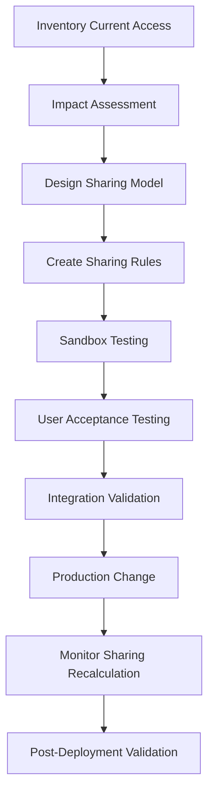

Changing **Organization-Wide Defaults (OWD)** from **Public Read Only** to **Private** is one of the highest-impact security changes in Salesforce. It can affect users, integrations, automation, reports, dashboards, Apex code, and Experience Cloud users.

A structured approach helps prevent application outages.

## 1. Perform an Impact Assessment

Identify all objects whose OWD will change.

For each object, determine:

* Who currently accesses records they do not own?
* Which teams rely on visibility through OWD?
* Which integrations query records across ownership boundaries?
* Which reports and dashboards depend on organization-wide visibility?
* Which Apex classes use `with sharing`?
* Which Flows, Process Builders, and Approval Processes access records?

Create a matrix:

| Area             | Impact                            |
| ---------------- | --------------------------------- |
| Users            | May lose access to records        |
| Reports          | Report row counts may decrease    |
| Dashboards       | Dashboard results may change      |
| Apex             | Queries may return fewer records  |
| Flows            | Get Records may fail              |
| Integrations     | API queries may return fewer rows |
| Mobile App       | Users may see fewer records       |
| Experience Cloud | Visibility may change             |

---

## 2. Inventory Current Access Patterns

Use reports and SOQL to understand ownership.

Examples:

```sql
SELECT OwnerId, COUNT(Id)
FROM Account
GROUP BY OwnerId
```

Find records accessed by multiple teams.

Questions:

* Are records owned by queues?
* Are records owned by integration users?
* Are there orphaned records?

---

## 3. Review Sharing Mechanisms

Before changing OWD, design replacement access.

Potential mechanisms:

### Role Hierarchy

Managers need subordinate access.

Review:

```text
CEO
 ├─ Sales VP
 │   ├─ Sales Manager
 │   │   ├─ Sales Rep
```

---

### Sharing Rules

Create sharing rules before OWD change whenever possible.

Examples:

* Share Accounts owned by Sales East to Sales Leadership.
* Share Cases with Support Management.

---

### Teams

Review:

* Account Teams
* Opportunity Teams
* Case Teams

---

### Manual Sharing

Determine whether users rely on manual sharing.

---

### Apex Managed Sharing

Critical for complex business rules.

Review custom objects:

```text
MyObject__Share
```

and Apex sharing logic.

---

## 4. Review Apex Code

This is one of the most commonly missed areas.

Search for:

```apex
with sharing
```

and

```apex
inherited sharing
```

Potential issues:

```apex
List<Account> accts =
    [SELECT Id, Name FROM Account];
```

Previously:

* User saw all records because OWD was Public Read.

After Private:

* Query returns fewer records.

Application behavior may change.

Review:

* Apex controllers
* LWC Apex methods
* Aura controllers
* Batch Apex
* Queueables
* Invocable Actions

---

## 5. Review Flows

Check:

### Record Triggered Flows

### Screen Flows

### Auto-launched Flows

Potential failure:

```text
Get Records
```

may return no rows after OWD becomes Private.

Validate:

* User context
* System context
* Record access assumptions

---

## 6. Review Reports and Dashboards

Run comparison tests.

Examples:

* Sales pipeline reports
* Executive dashboards
* Forecasting reports

Expected impact:

* Record counts decrease.
* Totals change.
* Some dashboards appear empty.

---

## 7. Review Integrations

Common issue.

Integration user previously queried:

```sql
SELECT Id, Name FROM Account
```

and received all accounts.

After OWD becomes Private:

```text
Result set may shrink dramatically.
```

Verify:

* Connected Apps
* Middleware
* ETL jobs
* Agentforce integrations
* Data warehouses

Determine whether integration users need:

* View All
* Modify All
* Permission Sets
* Sharing Rules

---

## 8. Review Portal / Experience Cloud Access

If using:

* Partner users
* Customer users

Review sharing sets and sharing rules.

A Private OWD change may unexpectedly remove portal visibility.

---

## 9. Build Access Validation Test Scripts

Create test scenarios.

Example:

| User             | Expected Access      |
| ---------------- | -------------------- |
| Sales Rep        | Own Accounts         |
| Manager          | Team Accounts        |
| VP               | All Sales Accounts   |
| Support User     | Shared Cases         |
| Integration User | All Required Records |

Validate:

* Read
* Edit
* Delete
* Report visibility

---

## 10. Test in Full Sandbox

A Full Sandbox is strongly recommended.

Validate:

* User acceptance testing
* Integration testing
* Batch jobs
* Scheduled jobs
* Reports
* Dashboards
* Mobile users

---

## 11. Estimate Sharing Recalculation Time

Changing OWD triggers sharing recalculation.

Large data volumes may require:

* Hours
* Sometimes days

Monitor:

* Sharing Recalculation jobs
* Async processing

For orgs with millions of records, engage Salesforce support and review Large Data Volume (LDV) considerations.

---

## 12. Create a Rollback Plan

Document:

### Before Change

Capture:

* Current OWD settings
* Sharing rules
* Permission sets

### Rollback

Be ready to:

```text
Private → Public Read Only
```

if critical business processes fail.

---

## Recommended Change Sequence



## Common Breakages Seen in Real Projects

1. Sales managers suddenly cannot see team records.
2. Dashboards show much lower numbers.
3. Flows fail because `Get Records` returns no records.
4. LWC pages appear empty.
5. Integration users lose visibility.
6. Apex tests fail due to sharing assumptions.
7. Approval processes cannot locate related records.
8. Experience Cloud users lose access.
9. Account Team members no longer see opportunities.
10. Custom Apex sharing was never implemented because Public Read masked the requirement.

A good rule is: **implement and validate all required sharing mechanisms first, then change OWD to Private as the final step.** This minimizes disruption and makes it easier to identify any remaining access gaps.
