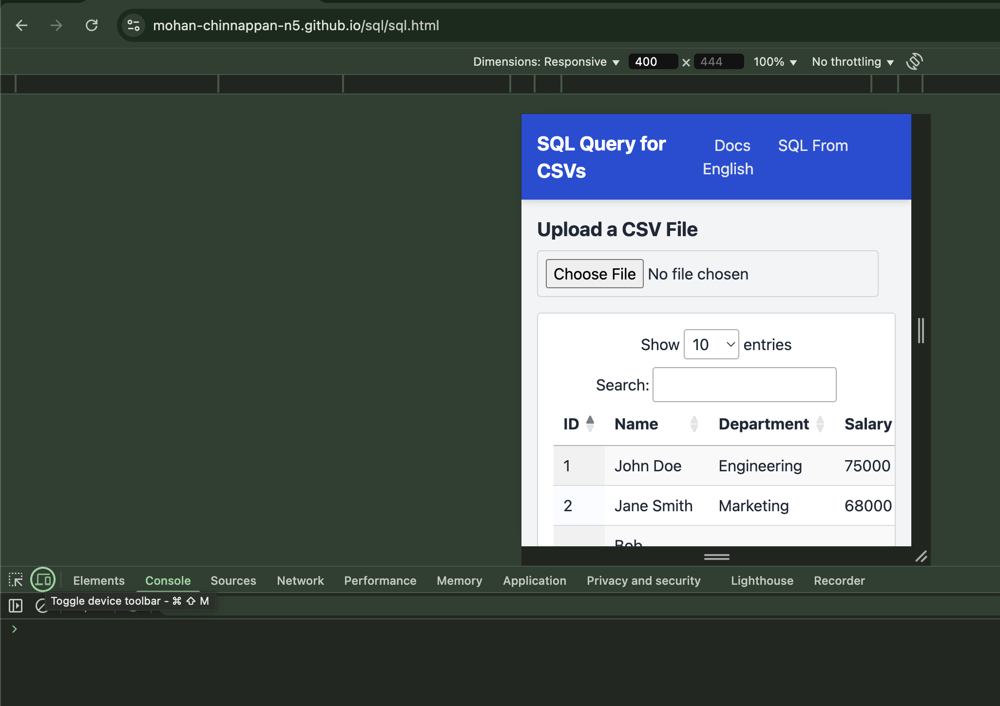
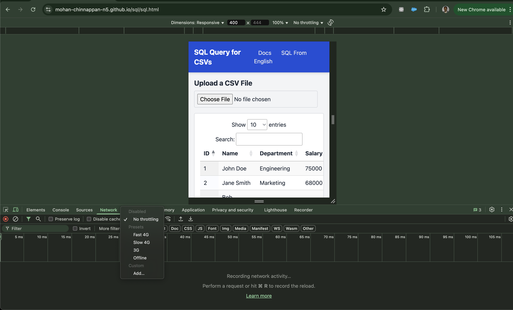

# White Paper: Mobile Performance Testing with Chrome DevTools – Network and Battery Considerations

## Abstract

Mobile performance testing is critical for ensuring optimal user experiences in web applications, particularly under varying network conditions (e.g., 3G, 4G) and device constraints like battery life. Chrome DevTools provides a robust, accessible platform for developers to simulate and analyze mobile performance without requiring physical devices. This white paper outlines a step-by-step methodology for conducting mobile performance tests using Chrome DevTools, with specific attention to emulating network conditions and addressing battery-related impacts.

## Introduction

As mobile usage dominates web traffic, ensuring fast load times and efficient resource usage is paramount. Chrome DevTools offers built-in features to simulate mobile environments, including device emulation, network throttling, and performance profiling. This paper explores how to leverage these tools to test web applications under realistic mobile conditions, including fluctuating network speeds and battery constraints.

## Methodology: Performance Testing with Chrome DevTools

### 1. Setting Up Chrome DevTools for Mobile Emulation

* **Open DevTools:** Launch Chrome and press F12 (or Ctrl+Shift+I on Windows/Linux, Cmd+Option+I on Mac) to open DevTools.
* **Enable Device Toolbar:** Click the "Device Toolbar" icon (a small rectangle and phone symbol) in the top-left corner.

* **Select a Device:** Choose a predefined mobile device (e.g., iPhone 12, Galaxy S20) from the dropdown menu to emulate its viewport and user agent. Alternatively, customize the resolution and device pixel ratio (DPR) to match specific hardware.

### 2. Simulating Network Conditions (3G/4G)

Network performance significantly impacts mobile user experience. Chrome DevTools allows throttling to mimic real-world conditions:

* **Access Network Tab:** Navigate to the "Network" tab in DevTools.
* **Throttle Settings:** From the "Network Throttling" dropdown (labeled "Online" by default), select presets like "Fast 3G," "Slow 3G," or "4G." These presets simulate typical latency, download, and upload speeds:
    * **Fast 3G:** ~750 Kbps download, ~750 Kbps upload, 100ms latency.
    * **Slow 3G:** ~400 Kbps download, ~400 Kbps upload, 200ms latency.
    * **4G:** ~4 Mbps download, ~4 Mbps upload, 50ms latency.
* **Custom Profiles:** For advanced testing, create a custom throttling profile by selecting "Add..." under the dropdown. Input specific latency, download, and upload values based on target regions or network providers.
* **Test Workflow:** Reload the page (Ctrl+R or Cmd+R) with throttling enabled to observe load times, resource waterfalls, and bottlenecks (e.g., large images, unoptimized scripts).

### 3. Performance Profiling

To measure runtime performance under mobile constraints:

* **Open Performance Tab:** Switch to the "Performance" tab in DevTools.
* **Record a Session:** Click the "Record" button, interact with the page (e.g., scrolling, clicking), and stop the recording.
* **Analyze Metrics:** Review the timeline for:
    * **Main Thread Activity:** Identify long tasks (>50ms) that may cause jank.
    * **Rendering Performance:** Check FPS (frames per second) and layout shifts.
    * **Resource Loading:** Pinpoint blocking resources (e.g., CSS, JS) that delay First Contentful Paint (FCP) or Largest Contentful Paint (LCP).
* **Mobile CPU Throttling:** Simulate slower mobile processors by enabling CPU throttling (e.g., 4x or 6x slowdown) under the "Performance" tab settings. This mimics lower-end devices.

### 4. Battery Condition Considerations

Battery life indirectly affects performance due to power-saving modes and thermal throttling on mobile devices. Chrome DevTools doesn’t directly simulate battery state, but you can approximate its impact:

* **Power-Intensive Operations:** Use the "Performance" tab to identify CPU-heavy tasks (e.g., excessive JavaScript execution, animations). These drain battery faster, triggering device throttling.
* **Network Requests:** Minimize requests by analyzing the "Network" tab. Frequent 3G/4G radio usage (e.g., polling APIs) consumes significant power.
* **Workaround for Battery Testing:** Manually enable "Low Power Mode" on a physical device, then use DevTools’ remote debugging (via USB or Chrome Remote Devices) to profile performance. Alternatively, infer battery impact by optimizing for low CPU/GPU usage.

## Best Practices

* **Optimize Assets:** Compress images, minify CSS/JS, and leverage modern formats (e.g., WebP, AVIF) to reduce network load.
* **Prioritize Critical Rendering Path:** Ensure above-the-fold content loads quickly, even on 3G.
* **Test Edge Cases:** Simulate "Offline" mode or high latency (e.g., 400ms) to prepare for poor connectivity.
* **Iterate:** Use Lighthouse (in the "Audits" tab) to score performance and get actionable recommendations.

## Limitations

* **Battery Simulation:** DevTools lacks native battery state emulation, requiring physical device testing for precise results.
* **Network Variability:** Presets are static and may not reflect real-world fluctuations (e.g., signal drops).
* **Hardware Constraints:** CPU throttling approximates but doesn’t fully replicate mobile chipsets.

## Conclusion

Chrome DevTools is a powerful tool for mobile performance testing, offering detailed insights into network behavior and runtime efficiency. By simulating 3G/4G conditions and optimizing for low resource usage, developers can enhance mobile experiences while mitigating battery-related challenges. For comprehensive testing, complement DevTools with real-device profiling to capture nuances like power-saving modes.

## References

* Google Chrome DevTools Documentation
* Web.dev Performance Guides